# WmlComparer Call Graph

## Mermaid Diagram

```mermaid
flowchart TD
    Compare --> CompareInternal

    subgraph PreProcess ["Pre-processing (runs twice, once per doc)"]
        PreProcessMarkup --> TestForInvalidContent
        PreProcessMarkup --> RemoveExistingPowerToolsMarkup
        PreProcessMarkup --> MarkupSimplifier.SimplifyMarkup
        PreProcessMarkup --> ChangeFootnoteEndnoteReferencesToUniqueRange
        PreProcessMarkup --> AddUnidsToMarkupInContentParts
        PreProcessMarkup --> AddFootnotesEndnotesParts
        PreProcessMarkup --> FillInEmptyFootnotesEndnotes
        PreProcessMarkup --> DetachExternalData
    end

    subgraph Hash ["Block hashing"]
        HashBlockLevelContent --> CloneBlockLevelContentForHashing --> CloneBlockLevelContentForHashingInternal
        HashBlockLevelContent --> AddSha1HashToBlockLevelContent
        AddSha1HashToBlockLevelContent --> CloneBlockLevelContentForHashing
    end

    CompareInternal --> PreProcessMarkup
    CompareInternal --> RevisionProcessor.AcceptRevisions
    CompareInternal --> RevisionProcessor.RejectRevisions
    CompareInternal --> HashBlockLevelContent
    CompareInternal --> AddUnidsToMarkupInContentParts
    CompareInternal --> ProduceDocumentWithTrackedRevisions

    subgraph Produce ["ProduceDocumentWithTrackedRevisions — main engine"]
        ProduceDocumentWithTrackedRevisions --> AddSha1HashToBlockLevelContent
        ProduceDocumentWithTrackedRevisions --> CreateComparisonUnitAtomList
        ProduceDocumentWithTrackedRevisions --> GetComparisonUnitList
        ProduceDocumentWithTrackedRevisions --> DetectUnrelatedSources
        ProduceDocumentWithTrackedRevisions --> Lcs
        ProduceDocumentWithTrackedRevisions --> MarkRowsAsDeletedOrInserted
        ProduceDocumentWithTrackedRevisions --> FlattenToComparisonUnitAtomList
        ProduceDocumentWithTrackedRevisions --> DetectMovesInAtomList
        ProduceDocumentWithTrackedRevisions --> DetectFormatChangesInAtomList
        ProduceDocumentWithTrackedRevisions --> AssembleAncestorUnidsInOrderToRebuildXmlTreeProperly
        ProduceDocumentWithTrackedRevisions --> ProduceNewWmlMarkupFromCorrelatedSequence
        ProduceDocumentWithTrackedRevisions --> MarkContentAsDeletedOrInserted
        ProduceDocumentWithTrackedRevisions --> CoalesceAdjacentRunsWithIdenticalFormatting
        ProduceDocumentWithTrackedRevisions --> IgnorePt14Namespace
        ProduceDocumentWithTrackedRevisions --> ProcessFootnoteEndnote
        ProduceDocumentWithTrackedRevisions --> RectifyFootnoteEndnoteIds
        ProduceDocumentWithTrackedRevisions --> ConjoinDeletedInsertedParagraphMarks
        ProduceDocumentWithTrackedRevisions --> FixUpRevisionIds
        ProduceDocumentWithTrackedRevisions --> MoveLastSectPrToChildOfBody
        ProduceDocumentWithTrackedRevisions --> FixUpFootnotesEndnotesWithCustomMarkers
        ProduceDocumentWithTrackedRevisions --> SimplifyMoveMarkupToDelIns
        ProduceDocumentWithTrackedRevisions --> FixUpDocPrIds
        ProduceDocumentWithTrackedRevisions --> FixUpShapeIds
        ProduceDocumentWithTrackedRevisions --> FixUpShapeTypeIds
        ProduceDocumentWithTrackedRevisions --> AddFootnotesEndnotesStyles
        ProduceDocumentWithTrackedRevisions --> CopyMissingStylesFromOneDocToAnother
        ProduceDocumentWithTrackedRevisions --> CopyMissingNumberingFromOneDocToAnother
        ProduceDocumentWithTrackedRevisions --> DeleteFootnotePropertiesInSettings
    end

    subgraph Atoms ["Atom list construction"]
        CreateComparisonUnitAtomList --> VerifyNoInvalidContent
        CreateComparisonUnitAtomList --> AssignUnidToAllElements
        CreateComparisonUnitAtomList --> MoveLastSectPrIntoLastParagraph
        CreateComparisonUnitAtomList --> CreateComparisonUnitAtomListInternal --> CreateComparisonUnitAtomListRecurse
        CreateComparisonUnitAtomListRecurse -->|recurse| CreateComparisonUnitAtomListRecurse
        CreateComparisonUnitAtomListRecurse --> AnnotateElementWithProps --> CreateComparisonUnitAtomListRecurse
    end

    subgraph CUList ["Comparison-unit tree construction"]
        GetComparisonUnitList --> GetHierarchicalComparisonUnits
        GetHierarchicalComparisonUnits -->|recurse| GetHierarchicalComparisonUnits
    end

    subgraph LcsEngine ["LCS engine — iterative loop over Unknown sequences"]
        Lcs -->|each Unknown| SetAfterUnids
        Lcs -->|1st try| ProcessCorrelatedHashes
        Lcs -->|2nd try if null| FindCommonAtBeginningAndEnd
        Lcs -->|3rd try if null| DoLcsAlgorithm
        DoLcsAlgorithm --> FindIndexOfNextParaMark
        DoLcsAlgorithm -->|single-table case| DoLcsAlgorithmForTable
        DoLcsAlgorithmForTable --> ApplyLcsToTableRows
        FindCommonAtBeginningAndEnd --> SplitAtParagraphMark
    end

    subgraph Reconstruct ["XML reconstruction"]
        ProduceNewWmlMarkupFromCorrelatedSequence --> CoalesceRecurse["CoalesceRecurse (part,list,level,settings)"]
        CoalesceRecurse -->|recurse| CoalesceRecurse
        CoalesceRecurse --> ReconstructElement["ReconstructElement (part,...)"]
        CoalesceRecurse --> MoveRelatedPartsToDestination
        CoalesceRecurse --> GetXmlSpaceAttribute
        MarkContentAsDeletedOrInserted --> MarkContentAsDeletedOrInsertedTransform
        ConjoinDeletedInsertedParagraphMarks --> ConjoinMultipleParagraphMarks --> ConjoinTransform
        DetectMovesInAtomList --> GroupConsecutiveAtomsByStatus
        DetectMovesInAtomList --> ExtractTextFromAtomBlock
        DetectMovesInAtomList --> CalculateJaccardSimilarity --> TokenizeForComparison
        DetectFormatChangesInAtomList --> GetRunPropertiesFromAtom
        DetectFormatChangesInAtomList --> AreRunPropertiesEqual --> NormalizeRunProperties
        DetectFormatChangesInAtomList --> GetChangedPropertyNames --> NormalizePropertyElement
    end
```

## Narrative

The algorithm has five clearly delineated phases:

### 1. Pre-processing (`PreProcessMarkup` × 2)

Both documents are normalised: MC markup stripped, comments/bookmarks removed, footnote IDs made globally unique, and every XML element stamped with a `unid` GUID.

### 2. Block hashing (`HashBlockLevelContent` × 2)

Each document is forked — one copy has tracked revisions _accepted_, the other _rejected_ — and SHA-1 hashes of every paragraph/table/row are back-propagated via `unid` onto the original tree. This is what lets the LCS engine treat whole blocks as equal without character-level inspection.

### 3. Atom decomposition (`CreateComparisonUnitAtomList` → `CreateComparisonUnitAtomListRecurse`)

Documents are flattened to a linear list of `ComparisonUnitAtom` objects (one per character, run-child, or paragraph mark). Runs are then re-grouped into `ComparisonUnitWord` objects and wrapped in a hierarchy of `ComparisonUnitGroup` (Paragraph → Cell → Row → Table) by `GetComparisonUnitList` / `GetHierarchicalComparisonUnits`.

### 4. LCS engine (`Lcs` — iterative, not recursive)

A work-list of `Unknown` `CorrelatedSequence` objects is processed until none remain. For each Unknown the engine tries three strategies in priority order:

- `ProcessCorrelatedHashes` — fast path, matches whole blocks whose pre-computed SHA-1 hash agrees
- `FindCommonAtBeginningAndEnd` — peels matching prefix/suffix off
- `DoLcsAlgorithm` — full O(n²) LCS on SHA-1 hashes; if it finds a single table on both sides it delegates to `DoLcsAlgorithmForTable` → `ApplyLcsToTableRows`

Each strategy returns a new list of Known + Unknown sequences; the Unknowns re-enter the loop. The result is a fully resolved list of Equal / Deleted / Inserted sequences.

### 5. XML reconstruction (`ProduceNewWmlMarkupFromCorrelatedSequence`)

`CoalesceRecurse` rebuilds the XML tree from the flattened atom list, emitting `pt:Status` attributes. `MarkContentAsDeletedOrInserted` converts those to `w:ins`/`w:del`/`w:moveFrom`/`w:moveTo` markup. A battery of fixup calls (`FixUpRevisionIds`, `ConjoinDeletedInsertedParagraphMarks`, `RectifyFootnoteEndnoteIds`, etc.) then cleans up IDs, footnotes, and structural artefacts.
